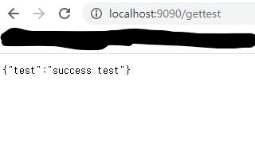

#TDD 및 스프링 구조를 학습하기 위한 로또번호 생성 프로그램

목표
1) TDD(테스트 주도 개발) 방식 이해 및 적용
2) 스프링 구조(내부 구현) 이해
3) JPA 동작 방식, 개념 

   
<h1>1. gettest컨트롤러 만들어 연결되는지 테스트</h1>
<h2>개발 목적</h2>
컨트롤러 생성  
SpringBootApplication 이해 

<h2>구현 목록</h2>
1.TestController 생성
<h2>에러 내역</h2>
Error creating bean with name 'inMemoryDatabaseShutdownExecutor' 
<h2>이유</h2>
DataSource를 따로 설정해두지 않았는데 자동으로 빈을 등록하려고 해서 생기는 문제 
<h2>해결</h2>
@SpringBootApplication에 (exclude = DataSourceAutoConfiguration.class) 추가 (자동 설정 제거) 
 
@SpringBootApplication(exclude = DataSourceAutoConfiguration.class)

<h2>결과</h2>

<h1>2. DB연결 </h1>
<h2>개발 목적</h2>
JDBC , JPA 이해

<h2>구현 목록</h2>
1. application.properties DB연결
2. Entity(LOTTO_NUMBER) 생성
3. LottoNumberRepository 생성 + Test Class 생성
4. UpdateNewLottoNumberService 생성 
5. LottoNumberRepositorytest  
5-1)testConnection() 구현 (문제 없음) 
5-2)getMaxRound() 구현 (null 에러일때 문제해결 처리해야함)

<h2>에러 내역</h2>
@Query의 결과가 null 일때 
<h2>이유</h2>
Database의 값이 없어 null로 결과 출력
<h2>해결</h2>
추후 해결예정
<h2>결과</h2>

<h1>2. test컨트롤러 lotto 최신회차 스크래핑 테스트</h1>
<h2>개발 목적</h2>
1)Jsoup를 이용해 스크래핑이 잘 되는지 테스트
2)TDD 익숙해지기위한 test개발

<h2>구현 목록</h2>
1. getTestLatestNumber() 메서드 생성

<h2>에러 내역</h2>
켰을 때 LOTTO_NUMBER 엔티티를 못찾는 에러가 발생
<h2>이유</h2>
인텔리제이 문제라하는데 정확한 이유 아직 못찾음
<h2>해결</h2>
껐다 켜보니 됐다 인텔리제이에서 자주 발생하는듯
<h2>느낀점</h2>
assertThat의 테스트값을 맞추는데 익숙하지 않았음

<h2>결과</h2>
현재 최신회차가 975회차기 때문에 테스트로 975를 맞춰줌 
스크래핑이 잘 되는지 테스트기 때문에 최신회차 값은 따로 하드코딩 

