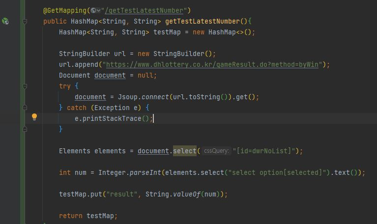
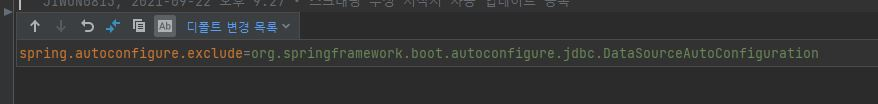

#TDD 및 스프링 구조를 학습하기 위한 로또번호 생성 프로그램

목표
1) TDD(테스트 주도 개발) 방식 이해 및 적용
2) 스프링 구조(내부 구현) 이해
3) JPA 동작 방식, 개념 

   
<h1>1. gettest컨트롤러 만들어 연결되는지 테스트</h1>
<h2>개발 목적</h2>
컨트롤러 생성  
SpringBootApplication 이해 

<h2>구현 목록</h2>
1.TestController 생성
<h2>에러 내역</h2>
Error creating bean with name 'inMemoryDatabaseShutdownExecutor' 
<h2>이유</h2>
DataSource를 따로 설정해두지 않았는데 자동으로 빈을 등록하려고 해서 생기는 문제 
<h2>해결</h2>
@SpringBootApplication에 (exclude = DataSourceAutoConfiguration.class) 추가 (자동 설정 제거) 
 
@SpringBootApplication(exclude = DataSourceAutoConfiguration.class)

<h2>결과</h2>

<h1>2. DB연결 </h1>
<h2>개발 목적</h2>
JDBC , JPA 이해

<h2>구현 목록</h2>
1. application.properties DB연결
2. Entity(LOTTO_NUMBER) 생성
3. LottoNumberRepository 생성 + Test Class 생성
4. UpdateNewLottoNumberService 생성 
5. LottoNumberRepositorytest  
5-1)testConnection() 구현 (문제 없음) 
5-2)getMaxRound() 구현 (null 에러일때 문제해결 처리해야함)

<h2>에러 내역</h2>
@Query의 결과가 null 일때 
<h2>이유</h2>
Database의 값이 없어 null로 결과 출력
<h2>해결</h2>
추후 해결예정
<h2>결과</h2>

<h1>2. test컨트롤러 lotto 최신회차 스크래핑 테스트</h1>
<h2>개발 목적</h2>
1)Jsoup를 이용해 스크래핑이 잘 되는지 테스트
2)TDD 익숙해지기위한 test개발

<h2>구현 목록</h2>
1. getTestLatestNumber() 메서드 생성

<h2>에러 내역</h2>
켰을 때 LOTTO_NUMBER 엔티티를 못찾는 에러가 발생
<h2>이유</h2>
인텔리제이 문제라하는데 정확한 이유 아직 못찾음
<h2>해결</h2>
껐다 켜보니 됐다 인텔리제이에서 자주 발생하는듯
<h2>느낀점</h2>
assertThat의 테스트값을 맞추는데 익숙하지 않았음

<h2>결과</h2>
현재 최신회차가 975회차기 때문에 테스트로 975를 맞춰줌 
스크래핑이 잘 되는지 테스트기 때문에 최신회차 값은 따로 하드코딩

<h1>3. StringBuilderPool 생성</h1>
<h2>개발 목적</h2>
1)StringBuilder를 사용하는데 메모리관리 위해 Pool로 만들어서 생성

<h2>구현 목록</h2>
1. StringBuilderPool 생성 (src -> java -> Core)

<h2>느낀점</h2>
C#에서 되는 문법들이 자바에서 안되는 경우가 많아 내부 구현 로직을 많이 찾아봄 
만들고 나니 제대로 만들었는지 추후 검토 필요 
공용 참조기 때문에 동기화를 해야함 mutex 사용을 더 알아보고 나중에 수정

<h2>결과</h2>
StringBuilder를 각 다른서비스에서 사용하려니 
"Duplicated code fragment" 해당 warning 뜨는 중 
이유를 자세히 알아보고 정확하게 수정해야할듯 효용성이 없는 Pool을 만들었을 수도 있음

<h1>4. Exception AOP 생성</h1>
<h2>개발 목적</h2>
1)AOP에 대한 이해 
2)모든 서비스 공통 try catch 처리 및 에러로그 구현

<h2>구현 목록</h2>
1. CheckExceptionAop구현

<h2>느낀점</h2>
AOP에 대한 개념 이해를 위해 공부하고 적용하려는데 배우고 나니까 아주 중요한 부분이라는걸 깨달음 
각 스크래핑에 대해 일일이 try catch를 적용했는데 그럴 필요 없이 AOP로 만들어서 적용하면 되는거였음 
일하는 곳이 자바, 스프링을 사용하지않아 이 부분은 크게 차이를 느낌

<h1>5. 확장메서드 구현</h1>
<h2>개발 목적</h2>
1)C# 처럼 확장메서드 구현 
2)자바 자체 확장메서드 구현 기능이 없어 manifold 플러그인 사용

<h2>구현 목록</h2>
1. StringExtension

<h2>현재 상황</h2>
현재 manifold 플러그인이 인텔리제이 최신버전과 호환이 되지않아 호환 될 때 까지 기다려야하는 상황 
확장메서드 구현은 여러모로 편해서 이번 프로젝트에서도 구현하려고 했지만 현재 구현 불가능

<h1>6. 서버 시작할 때 자동 스크래핑 생성</h1>
<h2>개발 목적</h2>
1)서버가 시작할 때 DB의 데이터보다 최신 데이터가 있으면 데이터값 자동 DB 저장 

<h2>구현 목록</h2>
1. lotto.application.UpdateNewLottoNumberService - autoUpdateNewRound 메서드 구현

<h2>에러 내역</h2>

1.에러1

<h2>이유</h2>
레포지토리 빈을 못찾아서 나는 문제
<h2>해결</h2>
메인Application에 @EnableJpaRepositories 어노테이션 추가

2.

<h2>이유</h2>
EntityManagerFactory를 못찾는 문제
<h2>해결</h2>
구글링으로 몇시간동안 찾아보고 수정해본 결과 
application.properties의 DB값이 이상하면 에러가 난다는 글을 봄 
확인해보고 하나씩 지워보면서 수정했는데 해당 부분을 삭제하니 에러가 사라짐

<h2>느낀점</h2>
먼저 빈이 어떻게 등록되는지에 대해 이해도가 부족하다는 것을 느낌 
또한 어노테이션을 추가했지만 정확히 어떤일을 하는지 잘 몰라 읽어보면서 사용 
EntityManagerFactory에 대해서 찾아봤는데 db설정에 대해 잘못됐을 때 왜 등록이 안되는지 자세하게 못찾아봐서 다시 찾아봐야함 
여러모로 찾아봐야 할 것이 많다 특히 빈 등록과 스캔이 어떻게되는지 찾아볼 예정 

<추가>
1. AOP적용 확인
AOP가 제대로 적용됐는지 로그가 나와서 AOP를 잘 통해서 가는지 확인 제대로 동작함

2. DB에 최신 값들이 잘 들어가는지 확인
Insert자체는 잘되는거 확인 
데이터가없어 1회차부터 받는데 시간이 오래걸렸다 그런데 번호 값들이 안들어와 다시 디버깅해봐야함